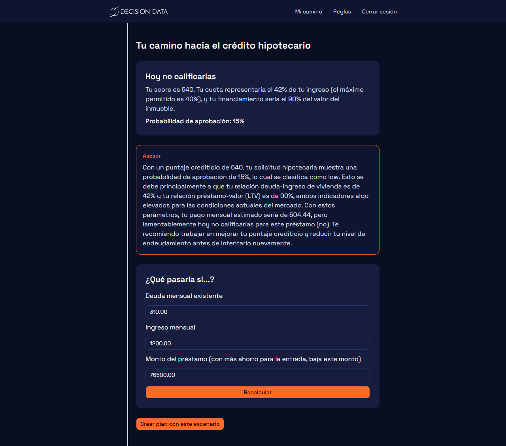
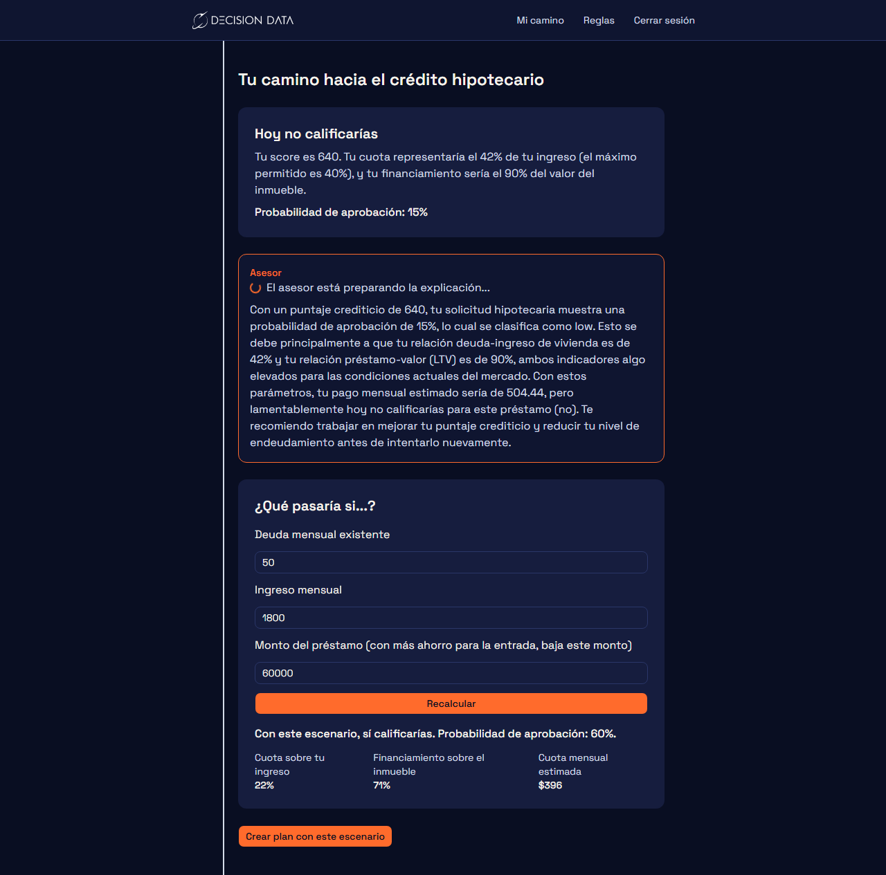
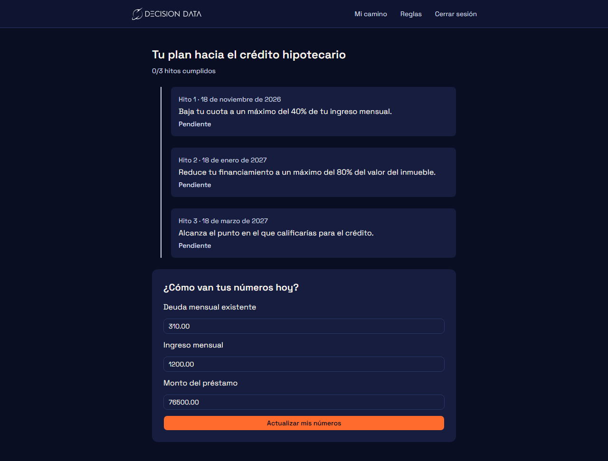
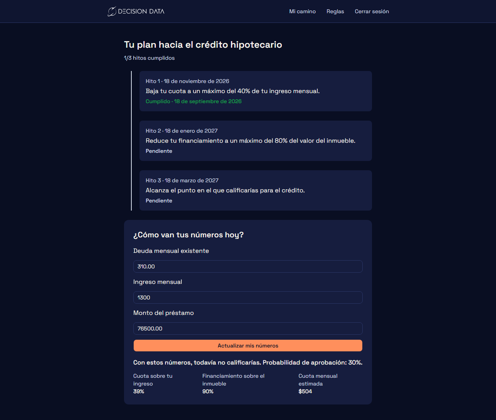

# Decision Data Ruta

Plataforma B2C para el reto técnico de Decision Data: le muestra a una persona, con sus propios números, si hoy calificaría para un crédito hipotecario en Ecuador, por qué (explicado por un agente de IA con anti-alucinación), y le da un plan con hitos reales que puede ir cumpliendo y actualizando con el tiempo — no es una calculadora de un solo uso.

## Qué hace

- **Diagnóstico inmediato**: con el score, ingreso, deuda y meta de vivienda de la persona, calcula si calificaría hoy (DTI de vivienda, DTI total, LTV, probabilidad de aprobación) usando parámetros reales del mercado hipotecario ecuatoriano.
- **Asesor con IA**: un agente (Claude) explica el resultado en lenguaje natural, citando siempre las cifras que ya calculó el motor de reglas — nunca inventa números; si la respuesta no coincide con lo calculado, se descarta y se usa un mensaje de respaldo.
- **Simulador "¿qué pasaría si...?"**: la persona ajusta deuda, ingreso o monto del préstamo y ve el resultado recalculado al instante.
- **Plan con seguimiento real**: al crear un plan se generan hitos concretos (bajar la cuota, reducir el financiamiento, llegar a calificar). La persona puede volver cuando quiera, actualizar sus números reales, y el sistema marca solo los hitos que ya cumplió — con fecha real de cumplimiento y una barra de progreso — en vez de mostrar una lista estática.
- **Panel de reglas en vivo**: un administrador puede ajustar los parámetros del motor de reglas (límites de DTI/LTV, tasas) sin tocar código.

## Capturas

| Diagnóstico + asesor de IA | Simulador "¿qué pasaría si...?" |
| --- | --- |
|  |  |

| Plan recién creado | Después de actualizar tus números |
| --- | --- |
|  |  |

## Arquitectura

- **Backend** (`backend/`): NestJS + TypeORM + Postgres. Motor de reglas propio, autenticación JWT, endpoints de simulación/plan/hitos/check-in, integración con el LLM con validación anti-alucinación y bitácora de auditoría (`agent_logs`).
- **Frontend** (`frontend/`): Next.js (App Router) + Tailwind. Cliente API tipado propio, sin código compartido con el backend.
- **Infraestructura** (`infrastructure/`): Postgres en Docker, seed de datos de ejemplo.

Diseño completo: [`docs/superpowers/specs/2026-09-16-decision-data-ruta-design.md`](docs/superpowers/specs/2026-09-16-decision-data-ruta-design.md). Plan de pruebas y resultados de la verificación end-to-end: [`docs/test-plan.md`](docs/test-plan.md).

## Cómo correrlo

Con Docker (recomendado):

```bash
# 1. Base de datos
cd infrastructure
cp .env.example .env
docker compose up -d

# 2. Backend: configurar variables de entorno
cd ../backend
cp .env.example .env
# Editar backend/.env: reemplazar ANTHROPIC_API_KEY por una key real
# (opcional — sin ella, todo funciona excepto /agent/explain)

# 3. Backend + frontend (desde la raíz del repo)
cd ..
docker compose --env-file infrastructure/.env up -d --build

# 4. Preparar la base de datos (una sola vez, dentro del contenedor ya construido)
docker compose exec backend npm run migration:run
docker compose exec backend npm run seed
```

- Frontend: http://localhost:3000
- Backend: http://localhost:3001
- Usuario de ejemplo: `ana.demo@decisiondata.test` / `demo1234`

Sin Docker, o para desarrollo con recarga en caliente, ver [`backend/README.md`](backend/README.md) y [`frontend/README.md`](frontend/README.md).

## Pruebas

```bash
cd backend && npm test          # 36 tests
cd frontend && npm test         # 19 tests
cd frontend && npx playwright test   # E2E contra la app real corriendo
```

## Uso de IA en este proyecto

Documentado honestamente, con cada decisión y cada error detectado, en [`AI_USAGE.md`](AI_USAGE.md).
